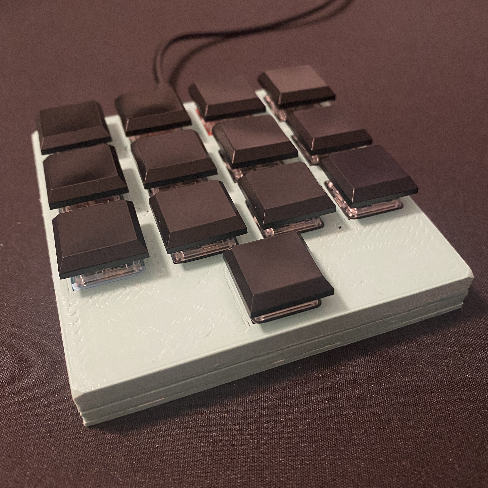
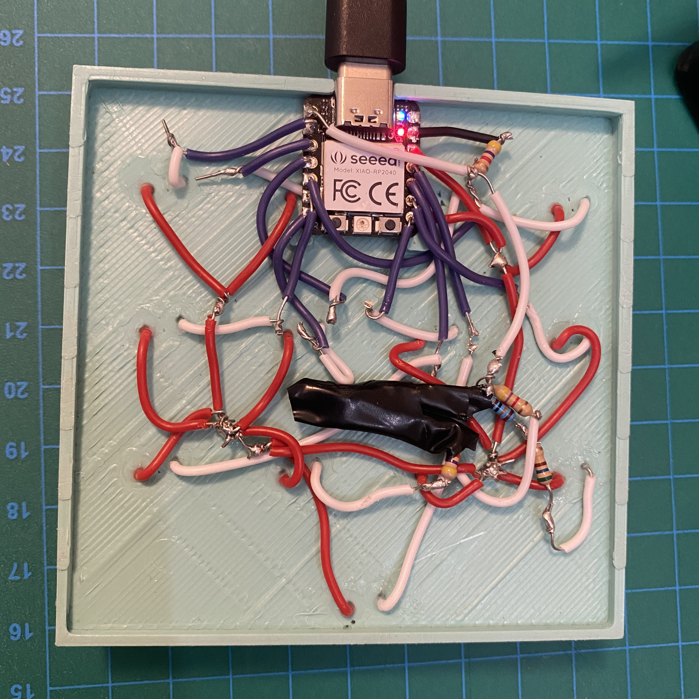

# a tiny DIY macropad

ingredients:
- XIAO rp2040
- kailh switches (all different from a sampler), other switches might need changes to the stl file
- some resistors for the "analog buttons" (not enough digital pins on MCU)

# schematic

